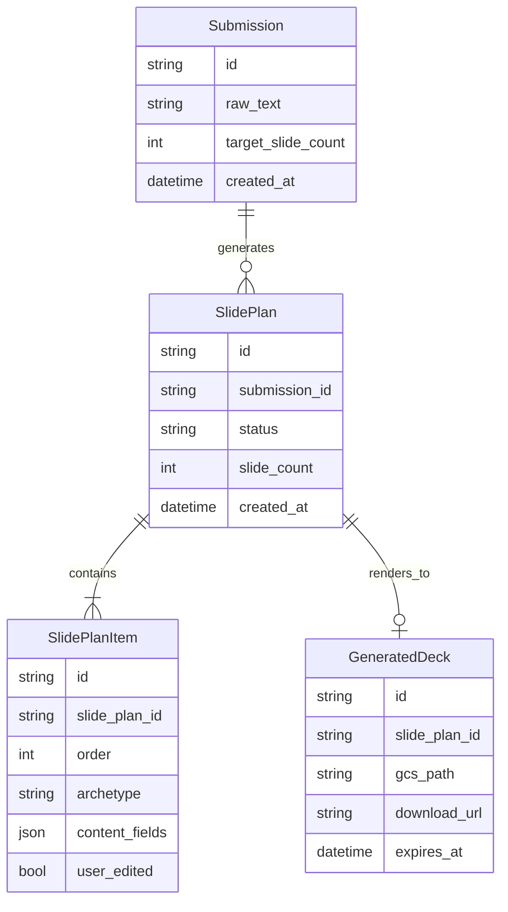
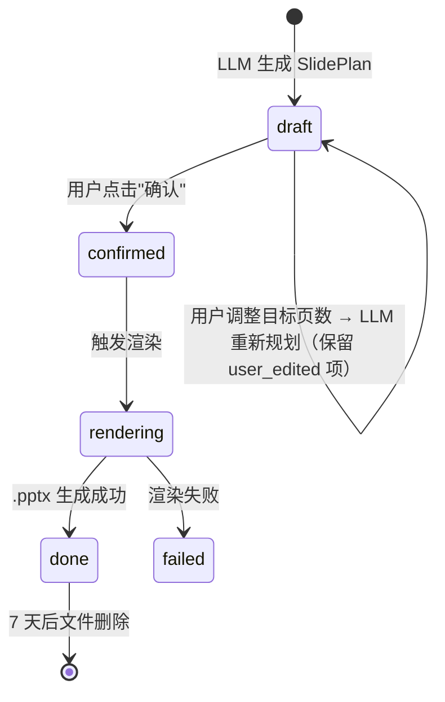

# 领域模型: ST PPT Agent

<!-- 
本文件是 AI agent 的"逻辑底座"。agent 在生成代码前会读取此文件,
确保实体命名、业务规则、数据处理逻辑和领域模型一致。

维护规则:
- 每次 Phase 5 EVOLVE 评审时检查是否需要更新
- 新增实体/规则时同步更新此文件
- 此文件的业务规则段落由你拥有,agent 只能建议修改,不能自行修改
-->

## 核心实体

## 业务规则（不可违反）

1. layout archetype **必须**来自 `st-ppt-brand` skill 定义的 11 个 archetype，LLM 不得发明新版式
2. 当用户指定目标页数少于 LLM 初次建议时，**必须**将内容合并/压缩进更少的页，**不得**直接截断丢弃内容
3. `user_edited = true` 的 SlidePlanItem **必须**在任何后续 LLM 重新规划中被保留，不得覆盖
4. SlidePlan 状态为 `confirmed` 时才可触发渲染，`draft` 状态的 SlidePlan **不得**生成 GeneratedDeck
5. LLM 拆页规划输出**必须**通过 Pydantic Schema 校验；缺字段时触发轻量重试（最多 2 次），第 3 次失败返回错误
6. 内容字数熔断：标题 ≤18 字、单条 bullet ≤40 字、单页 bullet ≤5 条；超出时 LLM 需压缩而不是截断
7. 原文需要图表/架构图的内容：**必须**生成占位框 + 提示文字（如"此处建议放置产品架构图"），MVP 不得自动生成或匹配图片
8. 品牌合规（颜色/字号/message bar/logo 安全区）**仅**由 python-pptx builder 的几何/样式代码层强制保证；语义层合规检查推迟到 V2
9. GeneratedDeck 文件**必须**在 7 天后删除；日志**不得**记录原始粘贴文案和生成内容，只记录任务 ID + 状态 + 耗时
10. LLM API 调用（拆页规划阶段）**必须**为异步任务模式，**不得**使用同步阻塞 HTTP 请求等待结果

## 术语表

| 中文术语 | 英文术语 | 定义 | 代码命名 |
|--------|--------|------|---------|
| 提交 | Submission | 同事一次粘贴文案的提交，包含原始文案和目标页数 | `submission` / `Submission` |
| 拆页规划 | SlidePlan | LLM 对原始文案的分页方案，含多个 SlidePlanItem | `slide_plan` / `SlidePlan` |
| 拆页规划项 | SlidePlanItem | 一页的规划单元，含 archetype 和内容字段 | `slide_plan_item` / `SlidePlanItem` |
| 版式原型 | Archetype | `st-ppt-brand` skill 定义的 11 种布局类型之一 | `archetype` |
| 草稿状态 | draft | SlidePlan 待用户确认的状态 | `"draft"` |
| 已确认状态 | confirmed | 用户确认后的 SlidePlan，可触发渲染 | `"confirmed"` |
| 用户已编辑 | user_edited | SlidePlanItem 被用户手动修改后的标记 | `user_edited: bool` |
| 生成文件 | GeneratedDeck | 渲染出的 .pptx 文件（含 GCS 路径和下载链接） | `generated_deck` / `GeneratedDeck` |
| 占位框 | Placeholder | 图表/架构图缺失时的替代元素，含提示文字 | `placeholder` |
| 字数熔断 | Content guardrail | 防止文本溢出的字数上限约束 | （Pydantic validator） |

## 数据边界

### 数据源

| 数据源 | 类型 | 可信度 | 注意事项 |
|--------|------|--------|---------|
| 同事粘贴文案 | 用户输入（自由文本） | 低（未验证） | 可能含未公开产品/客户信息，需遵守日志脱敏规则 |
| Claude API | LLM 推理 | 中（需 Schema 校验） | 输出需 Pydantic 校验，失败最多重试 2 次 |
| st-ppt-brand skill | 内部规则库 | 高（已验证） | brand-spec.md / layout-rules.md / 11 个 archetype builder 函数 |
| Google Cloud Storage | 文件存储 | 高 | GeneratedDeck 存储，7 天自动删除，使用带签名 URL 提供下载 |

### 更新频率

| 数据源 | 更新周期 | 检查方式 |
|--------|---------|---------|
| st-ppt-brand skill | 按需（品牌规范变更时） | 手动检查 layout-rules.md 版本 |
| archetype 列表 | 按需 | 检查 skill 中 archetype 枚举是否有新增 |

### 已知数据质量问题

- LLM 可能误解产品术语、擅自补充未提及事实、遗漏限制条件——SlidePlan 确认环节需用户核对
- python-pptx 生成的文件在 Windows/Mac/Web PowerPoint 中字体/换行/图形位置可能有差异，需三端测试
- LLM 输出的 JSON 字段可能缺失（archetype 对应必填字段未全部输出），需 Pydantic 校验 + 重试机制兜底

## 状态机

## 外部系统集成

| 系统 | 用途 | 认证方式 | 限制 |
|------|------|---------|------|
| Claude API | LLM 拆页规划（结构化 JSON 输出） | API Key via env | 响应时间上限 60 秒；Schema 校验失败最多重试 2 次 |
| st-ppt-brand skill | python-pptx builder 函数（渲染层） | 无（内部代码复用） | 11 个 archetype，不允许扩展 |
| Google Cloud Storage | 存储 GeneratedDeck .pptx 文件 | Service Account / Workload Identity | asia-east1；文件 7 天 TTL；带签名 URL 公开下载（无需登录） |
| Cloud Run | 部署 FastAPI/Flask 后端 | GCP IAM | port 8080；请求超时 5 分钟（可配置更长）；异步任务避免阻塞 |
